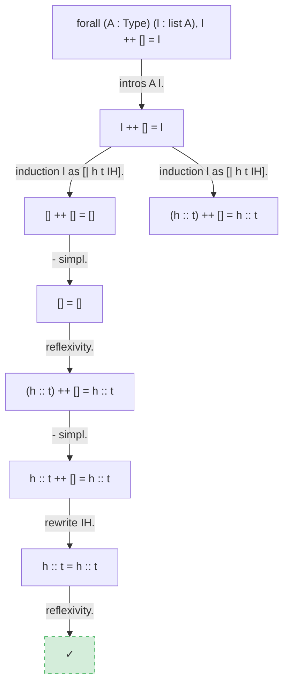

# Poule à Coq

*"Un coq a bien besoin d'une poule."
(A rooster really needs a hen.)*

Poule ("Hen") makes Coq ("Rooster") accessible in natural language via [Claude Code](https://docs.anthropic.com/en/docs/claude-code).

## Who Is This For

Students and newcomers learning Coq and formal proof — no prior experience with theorem provers required.

## What Is Claude Code

[Claude Code](https://docs.anthropic.com/en/docs/claude-code) is Anthropic's agentic coding tool — you interact with it in natural language from your terminal. Poule extends Claude's capabilities through the [Model Context Protocol (MCP)](https://modelcontextprotocol.io/): when you ask Claude a question about Coq, it automatically calls the right Poule tools behind the scenes and presents the results in plain language. You never need to invoke tools directly.

## What You Get

### Docker Container

The Docker image contains everything you need to get started: Coq, commonly used libraries, and all of Poule's enhancements (MCP server, search index, textbook, tactic model). Nothing is installed on your computer and no configuration is required.

### Education

The [Software Foundations](https://softwarefoundations.cis.upenn.edu) textbook series is included and fully searchable via Claude Code. Ask questions with the `/textbook` slash command. Claude also provides textbook references as part of its responses in other operations.

- **Textbook search** — search *Software Foundations* by concept, tactic, or proof technique via `/textbook`
- All 7 SF volumes bundled offline in the container — no internet required
- `/explain-proof` and `/explain-error` automatically cite relevant SF passages with browser-openable links
- SF HTML books available at `~/software-foundations/` for direct browser reading

### Searchable Coq Libraries

Six Coq libraries ship with prebuilt indexes: **stdlib**, **MathComp**, **std++**, **Flocq**, **Coquelicot**, and **CoqInterval**. All six are merged into a single searchable index — no configuration required. Search via natural language.

- **By name** — find lemmas by name or pattern (e.g., `Nat.add_*`)
- **By type** — describe the type signature you're looking for and Claude finds matching lemmas
- **By structure** — find lemmas with a similar shape to an expression you provide
- **By symbol** — find lemmas that mention specific definitions or types
- **By relationship** — navigate what a lemma uses, what uses it, and what else lives in the same module or typeclass

### Tactic Suggestion

A lightweight neural network offers fast tactic suggestions via the `suggest_tactics` tool. The idea is that you have a conversation with Claude about how to develop your proof as a learning exercise — Claude functions as a thinking partner, providing suggestions, explanations, and textbook references. For stronger automated solving, use CoqHammer (`hammer`, `sauto`, `qauto`), which is also available through the same proof interaction tools.

### Proof Interaction

- Open interactive proof sessions on `.v` files
- Observe proof states, submit tactics, step forward/backward
- Extract full proof traces showing which lemmas each tactic used
- Work on multiple proofs at once

### Proof Profiling

- Profile individual proofs or entire files — per-tactic timing ranked from slowest to fastest
- Separate proof-checking time (`Qed`) from tactic execution time, so you know where slowness comes from
- Identify bottlenecks with plain-language explanations and concrete optimization suggestions
- Break down time spent inside custom Ltac tactics
- Compare timing between runs to catch regressions
- Project-wide profiling with ranked summaries of slowest files and lemmas

### Proof Assistants

- **Auto/eauto trace explanation** — when `auto` or `eauto` fails to solve a goal, Claude explains which hints were tried, why each was rejected, and what to try instead
- **Pattern matching assistant** — when `destruct` or `induction` fails on dependent types, Claude diagnoses the problem and suggests fixes (reordering hypotheses, using `dependent destruction`, the convoy pattern, or Equations)
- **Setoid rewriting assistant** — when `rewrite` fails because you're rewriting under a function that doesn't preserve your equivalence relation, Claude identifies the missing compatibility proof and generates it for you

### Visualization

- Proof state, proof tree, dependency subgraph, and step-by-step sequence diagrams
- Generated as Mermaid syntax; each visualization tool call writes a self-contained `proof-diagram.html` to your project directory
- Open `proof-diagram.html` in your browser and bookmark it — refresh after each visualization to see the latest diagram
- Poule always overwrites the same `proof-diagram.html` path — rename or copy the file if you want to keep a diagram

**Example:** proof tree for `app_nil_r` (`forall (A : Type) (l : list A), l ++ [] = l`)



## Examples

> 👉 **[See examples of what you can ask](https://github.com/ekirton/Poule/blob/main/examples/README.md)** — search, proof interaction, profiling, debugging, visualization, and more.

**Skills (slash commands):**

Poule also provides compound workflows that orchestrate multiple tools in a single command:

- *`/formalize For all natural numbers, addition is commutative`* — Claude searches for existing lemmas, proposes a formal Coq statement, type-checks it, and helps build the proof interactively
- *`/explain-proof Nat.add_comm`* — step through a proof with plain-language explanations of each tactic, including mathematical intuition
- *`/compress-proof rev_involutive in examples/lists.v`* — find shorter proof alternatives, verify each one, present ranked options
- *`/proof-obligations`* — scan your project for `admit`/`Admitted`/`Axiom`, classify intent, rank by severity
- *`/proof-repair`* — after a Coq version upgrade, systematically fix broken proofs through a build→fix→rebuild loop
- *`/proof-lint examples/lint_targets.v`* — detect deprecated tactics, inconsistent bullets, and complex tactic chains; optionally auto-fix
- *`/explain-error`* — parse a Coq type error, fetch relevant definitions, explain the root cause in plain language with fix suggestions
- *`/migrate-rocq`* — bulk-rename deprecated `Coq.*` namespaces to `Rocq.*` with build verification
- *`/check-compat`* — check dependency compatibility before you hit opaque build failures
- *`/scaffold`* — generate a complete project skeleton (Dune, opam, CI, boilerplate)

For the full list of skills and their details, see [Skills Reference](SKILLS.md).

**Capabilities provided to Claude:**

| Category | What Claude can do |
|----------|--------------------|
| **Search** | Find lemmas by name, type signature, structure, or symbol usage; navigate dependencies; browse modules |
| **Proof interaction** | Open interactive proof sessions, observe goal states, submit tactics, step through proofs, see which lemmas each step used |
| **Profiling** | Time individual tactics, find bottlenecks, get optimization suggestions, compare runs for regressions |
| **Proof assistants** | Diagnose `auto`/`eauto` failures, fix dependent pattern matching errors, resolve rewriting compatibility issues |
| **Visualization** | Render proof states, proof trees, dependency graphs, and step-by-step proof evolution as diagrams in your browser |
| **Skills** | Multi-step workflows: formalization, proof compression, explanation, linting, repair, migration, compatibility analysis, error diagnosis, scaffolding |

For the full list of MCP tools and their parameters, see [MCP Tools Reference](MCP.md).

## Quick Start

Requires [Docker](https://docs.docker.com/get-docker/) and an [Anthropic API key](https://console.anthropic.com/).

**1. Get the launcher script**

```bash
curl -fsSL https://raw.githubusercontent.com/ekirton/Poule/main/bin/poule -o ~/bin/poule && chmod +x ~/bin/poule
```

Or clone the repo:

```bash
git clone https://github.com/ekirton/Poule.git
cp Poule/bin/poule ~/bin/poule
chmod +x ~/bin/poule
```

Make sure `~/bin` is on your `PATH` (add `export PATH="$HOME/bin:$PATH"` to your `~/.zshrc` or `~/.bashrc` if needed).

**2. Run**

```bash
poule          # run this from your project directory
```

To always start with the same project regardless of your current directory, set `POULE_PROJECT_DIR` (e.g., add `export POULE_PROJECT_DIR=~/Projects/my-coq-project` to your shell profile).

Everything runs inside the container — no local Coq, Python, or opam installation required. All six libraries are pre-installed for proof interaction. Claude Code, the search index, the textbook, and the tactic model are baked into the image for instant startup. On first run, the launcher pulls the image and initializes a persistent home directory at `~/poule-home`.

### Updating

The launcher automatically pulls the latest container image each time you run `poule`. The image includes Claude Code, the search index, all Coq libraries, the textbook, and the tactic model — everything updates together.

## FAQ

See [FAQ.md](FAQ.md).

## Development

See [DEVELOPMENT.md](DEVELOPMENT.md) for architecture, project structure, testing, and documentation layers.

## License

See [LICENSE](LICENSE) and [NOTICE](NOTICE).
