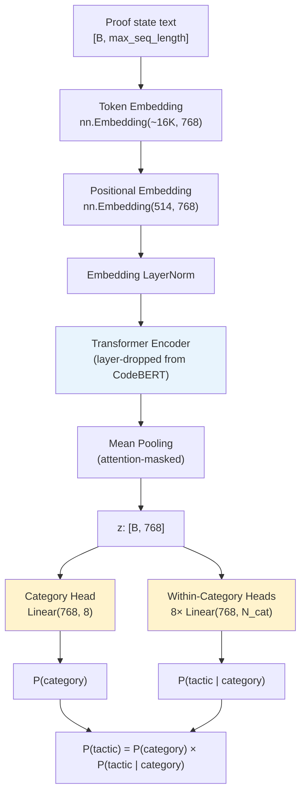

# Tactic Prediction from Proof States

## Overview

The tactic predictor is a small neural network that suggests which tactic families (e.g., `apply`, `rewrite`, `induction`) are most likely to make progress on a given Coq proof state. It is designed to run on a student's laptop — no GPU required — and provide useful hints with educational explanations rather than solve proofs automatically.

When a student is stuck mid-proof, the model suggests a short ranked list of tactic families. Claude then uses these predictions as a starting point to explain *why* each tactic makes sense in the current proof context, linking to relevant proof techniques and textbook material. The model provides the "what to try next" signal; Claude provides the "why" and the pedagogical scaffolding.

This is not an automated prover. Systems like CoqHammer, Tactician, and Proverbot9001 aim to close proof goals without human involvement. The goal here is the opposite: keep the student in the loop, help them build intuition about proof structure, and accelerate learning through contextual suggestions with explanations.

## Why Tactic Prediction, Not Premise Selection

The original plan was neural premise selection: given a proof state, retrieve the lemmas most likely to be useful. This is the dominant paradigm in Lean (ReProver, LeanHammer) and Isabelle (Magnushammer), where mature extraction infrastructure produces millions of (proof_state, premises_used) training pairs. But Coq's kernel does not track which lemmas each tactic consults. The extraction pipeline captures ~134,000 proof records, yet only ~3,500 produce non-empty premise lists — a 97% attrition rate. With 1,600x less data than LeanHammer's 5.8M pairs, the model could not achieve competitive retrieval quality.

The same extraction pipeline does capture the tactic text at every step. Every proof state has the tactic that was applied to it, regardless of whether that tactic's premises are known. This yields ~140,000 usable (proof_state, tactic) training pairs — a 40x larger signal from the same data. Tactic family prediction is a simpler task (classification, not retrieval) that is well-suited to this data volume and directly useful for suggesting next steps during interactive proof development.

## Prior Art

| System | Approach | Training data | Results |
|--------|----------|--------------|---------|
| Tactician (Blaauwbroek et al., 2020) | k-NN on proof states -> tactic | Coq stdlib + 120 packages | 39% of Coq theorems proved |
| CoqHammer (Czajka & Kaliszyk, 2018) | ATP premise selection + reconstruction | Coq stdlib | ~40% automation rate |
| Proverbot9001 (Sanchez-Stern et al., 2020) | RNN tactic prediction | Coq CompCert | 48% of theorems in 10 minutes |
| GPT-f (Polu & Sutskever, 2020) | Transformer tactic generation | Lean Mathlib | 56.5% on miniF2F |
| HTPS (Lample et al., 2022) | Hyper-tree proof search + tactic gen | Lean/Metamath | 82.6% on miniF2F |
| ReProver (Yang et al., 2023) | Retrieval-augmented tactic generation | Lean Mathlib (LeanDojo) | 51.2% on LeanDojo benchmark |

The common thread: tactic prediction works well even without per-step premise annotations, because the model learns tactic patterns from the proof state structure alone.

## Training Data

The extraction pipeline emits JSONL training data with (proof_state, tactic) pairs:

| Metric | Value |
|--------|-------|
| Total steps | 140,358 |
| Unique states | 136,936 |
| Missing tactic | 0 |
| Malformed records | 0 |

Top tactic families by frequency:

| Family | Count | % |
|--------|------:|--:|
| `rewrite` | 26,950 | 19.2% |
| `apply` | 24,562 | 17.5% |
| `intros` | 10,702 | 7.6% |
| `auto` | 5,692 | 4.1% |
| `unfold` | 5,232 | 3.7% |
| `have` | 4,184 | 3.0% |
| `move=>` | 3,890 | 2.8% |
| `case` | 3,834 | 2.7% |
| `destruct` | 3,831 | 2.7% |

The top 20 families cover ~80% of all steps. The hierarchical taxonomy groups all tactics into 8 categories with 65 tactic families total.

## Proof State Representation

### Structured serialization

Proof states are serialized into a structured format with explicit markers before tokenization. Given a flat proof state:

```
n : nat
m : nat
n + m = m + n
```

The serializer produces:

```
[PREV=intros] [DEPTH=2] [NGOALS=1] [HEAD=eq] [HYP] n [TYPE] nat [HYP] m [TYPE] nat [GOAL] n + m = m + n
```

The structural markers serve three purposes:

1. **Context features** (`[PREV=...]`, `[DEPTH=...]`, `[NGOALS=...]`, `[HEAD=...]`) encode proof context that is predictive of the next tactic but not present in the goal text itself. For example, a shallow proof at depth 1 is more likely to need `intros` than `reflexivity`.

2. **Structural boundaries** (`[HYP]`, `[TYPE]`, `[BODY]`, `[GOAL]`, `[GOALSEP]`) make the proof state's structure explicit to the tokenizer. Without these, the model would need to learn from raw text that `n : nat` is a hypothesis binding — the markers provide this for free.

3. **Goal head** (`[HEAD=eq]`, `[HEAD=forall]`, etc.) extracts the outermost constructor of the first goal's type. This is one of the strongest signals for tactic selection — an equality goal suggests `rewrite` or `reflexivity`, while a universal quantification suggests `intros`.

### BPE tokenization

The proof state text is tokenized using a SentencePiece BPE model trained on ~140K proof states:

| Property | Value |
|----------|-------|
| Vocabulary size | ~16,000 tokens |
| Encoding | Byte Pair Encoding (BPE) |
| Special tokens | `[PAD]`, `[UNK]`, `[CLS]`, `[SEP]`, `[MASK]` |
| Structural markers | `[HYP]`, `[TYPE]`, `[BODY]`, `[GOAL]`, `[GOALSEP]` (atomic, never split) |
| Context features | `[PREV=X]`, `[DEPTH=N]`, `[NGOALS=N]`, `[HEAD=X]` (atomic) |
| Max sequence length | 256 tokens (training) |

BPE learns subword units from the data: frequent Coq tokens like `forall`, `nat`, and `Prop` get their own entries, while rare identifiers are decomposed into subword pieces. This balances vocabulary coverage with embedding quality — every token in the vocabulary has enough training signal to learn a meaningful representation.

The encoding pipeline wraps each proof state with `[CLS]` and `[SEP]` tokens, truncates to `max_length`, and pads with `[PAD]` tokens.

## Model Architecture



### Encoder

The encoder is initialized from Microsoft CodeBERT (`microsoft/codebert-base`), a RoBERTa model pretrained on six programming languages. Although none of these are Coq, they share structural patterns — lexical scoping, function application, type annotations, infix operators — that transfer well.

| Property | Value |
|----------|-------|
| Hidden size | 768 |
| Attention heads | 12 |
| Transformer layers | Configurable (default 6, from CodeBERT's 12) |
| FFN intermediate size | 3,072 |
| Activation | GELU |
| Token embedding | Full-rank 768-d (no factorization) |

**Layer dropping.** When fewer than 12 layers are used, layers are selected at evenly spaced indices from CodeBERT's 12 layers (e.g., 6 layers -> indices 0, 2, 4, 6, 8, 10). This follows DistilBERT (Sanh et al., 2019), which retained ~97% of BERT's performance with 40% fewer parameters. It is a single code change with no separate distillation phase.

**Embedding initialization.** The token embedding layer is replaced with a new embedding sized to the BPE vocabulary (~16K tokens). Tokens that overlap with CodeBERT's original vocabulary copy their pretrained weights; new tokens are initialized from N(0, 0.02). With BPE, the vocabulary is small enough that full-rank 768-dimensional embeddings are practical — every token appears frequently enough to learn a meaningful representation.

**Mean pooling** aggregates the encoder output over non-padding positions: `sum(output * mask) / sum(mask)`. This produces a single 768-dimensional representation per input, which the classification heads map to logits.

### Hierarchical classification

The model uses a two-level hierarchical decomposition:

1. **Category head**: `Linear(768, 8)` predicts which of 8 tactic categories applies.
2. **Per-category within-heads**: 8 separate `Linear(768, N_cat)` heads predict the specific tactic within each category.

At inference time, the joint probability is: `P(tactic) = P(category) × P(tactic | category)`.

The joint loss during training is: `L = L_category + λ × L_within(active head)`, where `λ` balances category vs. within-category loss (default 1.0).

### Tactic taxonomy

Eight categories derived from the Coq tactic reference:

| Category | Tactics | Count |
|----------|---------|------:|
| Introduction | intros, intro, split, left, right, exists, eexists, constructor, econstructor, exact | 10 |
| Elimination | destruct, induction, case, elim, inversion, discriminate, injection | 7 |
| Rewriting | rewrite, replace, simpl, unfold, change, pattern, subst, f_equal, congruence, reflexivity, symmetry, transitivity | 12 |
| Hypothesis Management | apply, eapply, have, assert, enough, pose, set, specialize, generalize, revert, remember, cut, clear, rename | 14 |
| Automation | auto, eauto, trivial, tauto, intuition, firstorder, decide, now, easy, assumption | 10 |
| SSReflect | move, suff, wlog, congr, unlock | 5 |
| Arithmetic | lia, omega, ring, field | 4 |
| Contradiction | exfalso, absurd, contradiction | 3 |

Proof structure tokens (`-`, `+`, `*`, `{`, `}`) are excluded at data loading time — they are not tactics and are trivially predictable from subgoal count. SSReflect compound forms (e.g., `apply/eqP` -> `apply`, `case/andP` -> `case`) are normalized by stripping `/`-suffixes.

## Training Pipeline

### Class imbalance handling

The training data is heavily imbalanced: `rewrite` has 26,950 examples while some families have fewer than 50. Four techniques address this:

1. **Head-class undersampling.** Each tactic family is capped at 2,000 training examples, reducing the training set from ~95K to ~40K while preserving all rare-family data. Families with fewer than 100 examples (5% of the cap) are dropped as too sparse to learn.

2. **Inverse-frequency class weighting.** The cross-entropy loss is weighted per class: `weight[c] = (total / (num_classes × count[c])) ^ α`, where `α` controls rebalancing strength (default 0.4). This penalizes misclassifying rare families without fully inverting the distribution.

3. **Class-conditional label smoothing.** Soft targets replace hard one-hot labels: `y = (1-ε) × one_hot + ε × (w_c / Σw)`. Unlike standard label smoothing (which distributes mass uniformly), this directs smoothed mass toward classes proportional to their weights.

4. **Sharpness-Aware Minimization (SAM).** A two-step optimizer: (1) perturb parameters along the gradient direction by `ρ`, then (2) compute the gradient at the perturbed point and apply the base optimizer (AdamW). SAM seeks parameters in flat loss neighborhoods, improving generalization on imbalanced data.

### Hyperparameter optimization

The training pipeline includes an Optuna-based hyperparameter tuner (Tree-structured Parzen Estimator) that searches over model architecture and training configuration jointly:

| Hyperparameter | Range | Default |
|---|---|---|
| `num_hidden_layers` | {4, 6, 8} | 6 |
| `learning_rate` | [1e-6, 1e-4] | 2e-5 |
| `batch_size` | {16, 32, 64} | 32 |
| `weight_decay` | [1e-4, 1e-1] | 1e-2 |
| `class_weight_alpha` | [0.0, 1.0] | 0.4 |
| `label_smoothing` | [0.0, 0.2] | 0.1 |
| `sam_rho` | [0.15, 0.3] | 0.15 |
| `lambda_within` | [0.3, 3.0] | 1.0 |

10 trials with a `MedianPruner` (3-trial startup, 3-epoch warmup). Study state is persisted to SQLite for resumability. Each trial returns the best validation accuracy@5.

### Evaluation

The primary metric is **accuracy@5**: whether the correct tactic family appears in the model's top-5 predictions. This aligns with the use case — the student sees a ranked list of suggestions, and the prediction is useful if the right answer is anywhere in the list.

## Experimental Results

### Test set performance

| Metric | Value |
|--------|-------|
| Accuracy@5 | 67.8% |
| Accuracy@1 | 25.8% |
| Category Accuracy@1 | 40.0% |
| Zero-recall families | 34 of 65 |
| Trainable coverage (≥100 examples) | 31/43 (72.1%) |

### Best hyperparameters (HPO trial 3 of 10)

| Hyperparameter | Value |
|---|---|
| `num_hidden_layers` | 6 |
| `batch_size` | 16 |
| `learning_rate` | 1.58e-05 |
| `weight_decay` | 0.0397 |
| `class_weight_alpha` | 0.601 |
| `label_smoothing` | 0.142 |
| `sam_rho` | 0.152 |
| `lambda_within` | 2.80 |

Best validation acc@5 during HPO: 75.2%. The 8-point gap between validation (75.2%) and test (67.8%) indicates some overfitting to the validation distribution, though both sets are drawn from the same libraries.

### Per-category accuracy

| Category | Accuracy@1 |
|----------|--------:|
| Introduction | 46.7% |
| SSReflect | 38.2% |
| Elimination | 28.4% |
| Hypothesis Management | 22.2% |
| Rewriting | 21.3% |
| Arithmetic | 12.4% |
| Automation | 8.7% |
| Contradiction | 0.0% |

Introduction tactics are the most predictable — `intros` and `constructor` have distinctive proof state signatures (universal quantification, inductive goals). Contradiction has too few examples (146 total) and all three families (`exfalso`, `absurd`, `contradiction`) have zero recall.

### Top tactic families by recall

| Family | Precision | Recall |
|--------|--------:|------:|
| `have` | 0.232 | 0.653 |
| `intros` | 0.547 | 0.576 |
| `exists` | 0.279 | 0.509 |
| `split` | 0.240 | 0.492 |
| `induction` | 0.379 | 0.450 |
| `move` | 0.622 | 0.397 |
| `constructor` | 0.524 | 0.393 |
| `destruct` | 0.107 | 0.389 |
| `revert` | 0.122 | 0.359 |
| `replace` | 0.096 | 0.322 |

## Lessons Learned

Several experiments over the course of development shaped the current architecture. Key findings:

- **Hierarchical decomposition transforms the problem.** Replacing a flat 96-class classifier with an 8-category hierarchy improved validation accuracy by 10.5 percentage points. With fewer, better-defined classes per head, the model learns more effectively.

- **Undersampling is more effective than loss engineering.** Capping dominant families at 2,000 examples collapsed the validation-test gap from 35pp to 8pp and tripled the number of tactic families with non-zero recall (10 -> 31). In contrast, focal loss (Lin et al., 2017) and LDAM + DRW (Cao et al., 2019) both regressed test accuracy — the bottleneck is data sparsity for rare families, not the loss function's treatment of imbalance.

- **SAM is critical for generalization.** High SAM rho (perturbation radius ~0.18) was the single most important factor in closing the validation-test gap. When SAM rho dropped below 0.1, the gap tripled regardless of other hyperparameters.

- **Moderate class weight alpha works best.** The HPO-selected α = 0.6 outperformed both near-uniform (α < 0.2) and aggressive (α > 0.8) rebalancing. Combined with undersampling, moderate rebalancing improves rare-family recall without amplifying noise from the sparsest families.

- **Smaller models avoid overfitting under imbalance.** Consistent with Shwartz-Ziv et al. (2023), who found only 0.14 correlation between balanced and imbalanced performance across architectures. Layer dropping from 12 to 4–8 layers improved test accuracy.

- **Many tactic families remain unlearnable.** Even the best model has zero recall on 34 of 65 families. Of the 43 families with ≥100 training examples, 31 achieve non-zero recall (72% trainable coverage). The remaining zero-recall families have too few training examples for the model to learn — the limiting factor is data, not architecture. Cross-library evaluation (LOOCV) confirmed that the model memorizes library-specific patterns rather than learning general tactic selection.

## Deployment

### ONNX inference

The trained model is exported to ONNX for cross-platform CPU inference. With ~16K BPE vocabulary and full-rank embeddings, the model is substantially smaller than the earlier 158K-vocabulary version.

| Property | Value |
|----------|-------|
| Inference backend | ONNX Runtime (CPU) |
| Target latency | < 50 ms per prediction |
| Sequence length | 256 tokens |

### Argument retrieval

For tactics that take lemma arguments (`apply`, `rewrite`, `exact`), an `ArgumentRetriever` routes tactic families to retrieval strategies (type matching for `apply`/`exact`, equality filtering for `rewrite`). Combined with tactic family prediction, the system produces full tactic suggestions: `apply <candidate>`, `rewrite <candidate>`, etc.

### MCP integration

Tactic prediction is exposed as the `suggest_tactics` MCP tool, which takes a proof state and returns ranked tactic suggestions. This integrates into the existing proof session workflow: the student works interactively in Coq, gets stuck, asks Claude for help, and Claude calls `suggest_tactics` to ground its suggestions in the model's predictions.

## Implementation Scope

| Phase | Status |
|-------|--------|
| Phase 1: Emit tactic records | **Done** — 140K steps extracted, validated |
| Phase 2: Tactic classifier | **Done** — hierarchical model (CodeBERT encoder, 8 categories x 65 tactics, BPE tokenization, undersampling) |
| Phase 3: Argument retrieval | **Done** — ArgumentRetriever routes families to retrieval strategies; integrated into suggest_tactics |
| Phase 4: MCP integration | **Done** — TacticPredictor (ONNX), ArgumentRetriever, and suggest_tactics wired end-to-end |
